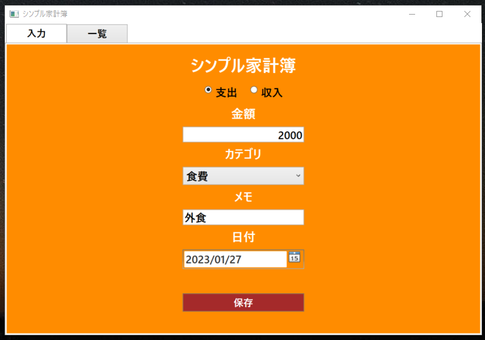
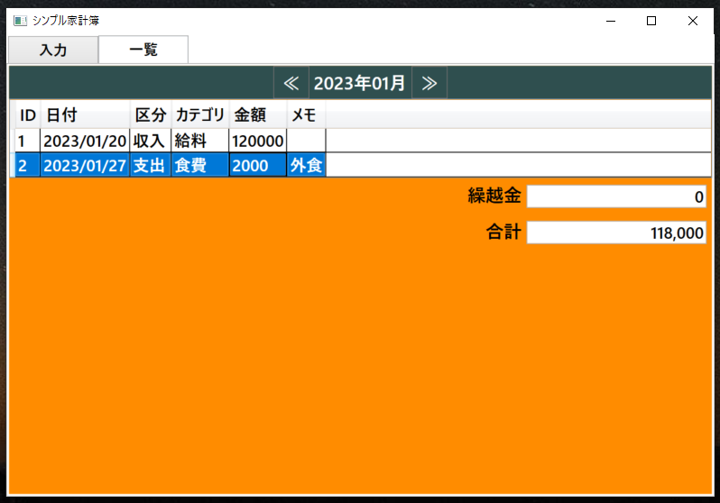
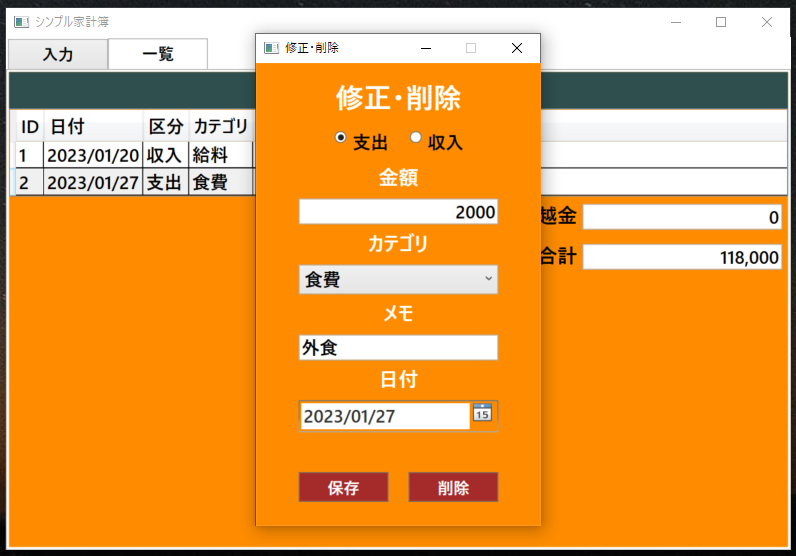

# シンプル家計簿

## 概要

シンプルにお金を管理できるWPFアプリケーションです。

このアプリを使用すれば、家計の収入と支出を簡単に把握することができます。

## 使い方

### 入力

1. ラジオボタンをクリックし、**支出**か**収入**のいずれかを選択します。

2. **金額**、**カテゴリ**、**メモ**、**日付**を入力します。

3. 最後に**保存ボタン**をクリックすれば入力完了です。

### 一覧表示

1. **一覧タブ**をクリックすると入力金額一覧表を表示します。

2. 一覧の中から行をダブルクリックすると修正・削除画面に移行します。

### 修正・削除

1. 修正する場合は修正が必要な項目を変更後、**保存ボタン**をクリックしてください。

2. 削除する場合は**削除ボタン**をクリックしてください。